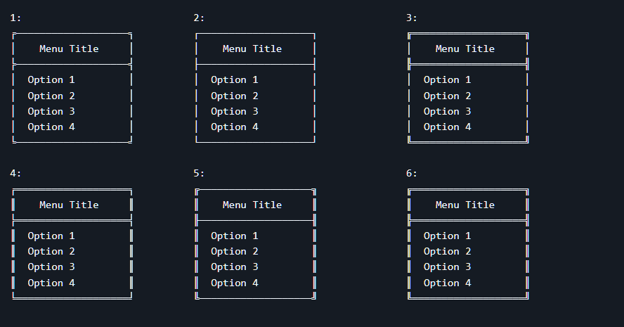

# Java CLI Frames

[](https://central.sonatype.com/artifact/io.github.1m7md-cs/cli-frames)
[](https://opensource.org/licenses/MIT)
[](https://www.oracle.com/java/)
[](https://github.com/1M7md-CS/java-cli-frame/issues)
[](https://github.com/1M7md-CS/java-cli-frame/stargazers)

A lightweight Java utility library for creating styled command-line interfaces with customizable frames, borders, ANSI colors, menus, and exit messages.

Designed for Java CLI applications that need clean and professional-looking console output without manually building borders and formatting.

## About This Project

This project was originally created as a small Java utility for styling command-line applications.

Although it was originally developed some time ago, it has been revisited, updated, and republished as a reusable Maven library.

The goal of this update was to make the project easier for other developers to use by publishing it to **Maven Central** instead of requiring users to manually copy the source files into their projects.

The library remains intentionally lightweight and focuses on providing simple utilities for creating styled and organized CLI output.

---

## Features

- Create styled CLI menu frames.
- Create styled exit messages.
- 6 built-in frame styles.
- Customizable frame styles.
- ANSI color support.
- Center-aligned text.
- Automatic longest-line calculation.
- Lightweight and easy to integrate.
- Available through Maven Central.
- Compatible with Java 21+.

---

## Requirements

- **Java 21 or higher**
- **Maven 3.9 or higher** if using Maven

---

## Installation

### Maven

Add the following dependency to your `pom.xml`:

```xml
<dependency>
    <groupId>io.github.1m7md-cs</groupId>
    <artifactId>cli-frames</artifactId>
    <version>1.0.1</version>
</dependency>
```

Maven will automatically download the library from Maven Central.

### Gradle

For Gradle projects:

```gradle
dependencies {
    implementation 'io.github.1m7md-cs:cli-frames:1.0.1'
}
```

### Gradle Kotlin DSL

```kotlin
dependencies {
    implementation("io.github.1m7md-cs:cli-frames:1.0.1")
}
```

---

## Usage

Import the `Frame` class:

```java
import io.github.mohammad.cli.frames.Frame;
```

The library provides methods for creating menu frames and exit messages.

---

## Menu Example

First, create your menu title:

```java
String title = "My Application";
```

Then create the menu options:

```java
String[] options = {
    "Option 1",
    "Option 2",
    "Option 3",
    "Option 4"
};
```

Calculate the longest line length:

```java
int longestLineLength =
        Frame.getLongestLineLength(title, options);
```

Finally, render the menu:

```java
Frame.printMenuFrame(
        title,
        options,
        longestLineLength,
        1
);
```

---

## Complete Menu Example

```java
import io.github.mohammad.cli.frames.Frame;

public class Main {

    public static void main(String[] args) {

        String title = "My Application";

        String[] options = {
            "Option 1",
            "Option 2",
            "Option 3",
            "Option 4"
        };

        int longestLineLength =
                Frame.getLongestLineLength(title, options);

        Frame.printMenuFrame(
                title,
                options,
                longestLineLength,
                1
        );
    }
}
```

---

## `printMenuFrame`

The `printMenuFrame` method takes four parameters:

```java
Frame.printMenuFrame(
        title,
        lines,
        longestLineLength,
        frameStyle
);
```

### Parameters

| Parameter | Type | Description |
|---|---|---|
| `title` | `String` | Title displayed inside the frame |
| `lines` | `String[]` | Lines or menu options displayed inside the frame |
| `longestLineLength` | `int` | Length of the longest line |
| `frameStyle` | `int` | Frame style from `1` to `6` |

### Example

```java
String title = "Main Menu";

String[] options = {
    "Start Game",
    "Settings",
    "Help",
    "Exit"
};

int longestLineLength =
        Frame.getLongestLineLength(title, options);

Frame.printMenuFrame(
        title,
        options,
        longestLineLength,
        2
);
```

---

## Exit Message

You can also create a styled exit message:

```java
String exitMessage =
        "Thank you for using our application!";

Frame.printExitMessage(exitMessage, 2);
```

The second parameter determines the frame style.

### Complete Example

```java
import io.github.mohammad.cli.frames.Frame;

public class Main {

    public static void main(String[] args) {

        String exitMessage =
                "Thank you for using our application!";

        Frame.printExitMessage(exitMessage, 2);
    }
}
```

---

## Frame Styles

The library currently supports **6 different frame styles**.

Available styles:

```text
1
2
3
4
5
6
```

For example:

```java
Frame.printExitMessage(
        "Goodbye!",
        1
);
```

Or:

```java
Frame.printExitMessage(
        "Goodbye!",
        6
);
```

You can use different styles throughout your CLI application to create different visual sections.

---

## Frame Examples



---

## API

### `getLongestLineLength`

Calculates the longest length between the title and the provided lines.

```java
int longestLineLength =
        Frame.getLongestLineLength(title, lines);
```

Example:

```java
String title = "Main Menu";

String[] lines = {
    "Start",
    "Settings",
    "Exit"
};

int length =
        Frame.getLongestLineLength(title, lines);
```

---

### `printMenuFrame`

Prints a formatted menu frame.

```java
Frame.printMenuFrame(
        title,
        lines,
        longestLineLength,
        frameStyle
);
```

---

### `printExitMessage`

Prints a formatted exit message.

```java
Frame.printExitMessage(
        message,
        frameStyle
);
```

---

## Example CLI Application

The library can be used to create a simple CLI application:

```java
import io.github.mohammad.cli.frames.Frame;

import java.util.Scanner;

public class Main {

    public static void main(String[] args) {

        Scanner scanner = new Scanner(System.in);

        String title = "Main Menu";

        String[] options = {
            "Start",
            "Settings",
            "Help",
            "Exit"
        };

        int longestLineLength =
                Frame.getLongestLineLength(title, options);

        Frame.printMenuFrame(
                title,
                options,
                longestLineLength,
                1
        );

        System.out.print("Select an option: ");

        int choice = scanner.nextInt();

        if (choice == 4) {
            Frame.printExitMessage(
                    "Thank you for using the application!",
                    2
            );
        }

        scanner.close();
    }
}
```

---

## Package

The library uses the following Java package:

```text
io.github.mohammad.cli.frames
```

Import the main class with:

```java
import io.github.mohammad.cli.frames.Frame;
```

---

## Project Structure

```text
java-cli-frame/
├── src/
│   └── main/
│       └── java/
│           └── io/
│               └── github/
│                   └── mohammad/
│                       └── cli/
│                           └── frames/
│                               ├── ConsoleColors.java
│                               └── Frame.java
├── .gitignore
├── LICENSE
├── pom.xml
└── README.md
```

---

## Maven Coordinates

The library is published to Maven Central with the following coordinates:

```text
Group ID:    io.github.1m7md-cs
Artifact ID: cli-frames
Version:     1.0.1
```

### Maven

```xml
<dependency>
    <groupId>io.github.1m7md-cs</groupId>
    <artifactId>cli-frames</artifactId>
    <version>1.0.1</version>
</dependency>
```

### Gradle

```gradle
implementation 'io.github.1m7md-cs:cli-frames:1.0.1'
```

---

## Repository

GitHub repository:

https://github.com/1M7md-CS/java-cli-frame

---

## Contributing

Contributions, issues, and feature requests are welcome.

If you find a bug or have an idea for improving the library:

1. Open an issue.
2. Describe the problem or feature.
3. Provide an example when possible.
4. Submit a pull request if you have an implementation.

---

## License

This project is licensed under the **MIT License**.

See the [LICENSE](LICENSE) file for the full license text.

---

## Author

**Mohammad Hammad**

GitHub:

https://github.com/1M7md-CS

Project:

https://github.com/1M7md-CS/java-cli-frame

---

## Version

Current version:

```text
1.0.1
```

Published on Maven Central.